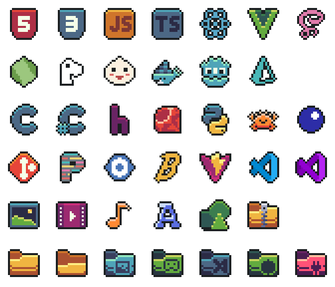

A pixel art icon theme for Visual Studio Code.

> [!NOTE]
> For best results set your Window Zoom Level to `0`. Anti-aliasing at non-integer scales makes pixel art look blurry.

## Why Pixel Icons?

I've always liked the 8-bit aesthetic, but I struggled to find a VS Code icon theme that felt truly complete.

Inspired by the excellent work of [Platinumaniac](https://github.com/Platinumaniac), I used their icons as a foundation and massively expanded the set. My goal is to cover most of the modern dev stack while keeping that crisp, hand-crafted retro feel. 🙂

## Installation

1. Open the **Extensions** sidebar in VS Code (`Ctrl+Shift+X`).
2. Search for `Pixel Icons`.
3. Click **Install**.

## Activation

1. Open the **Command Palette** (`Ctrl+Shift+P`).
2. Search for and select `Preferences: File Icon Theme`.
3. Choose **Pixel Icons** from the list.

## Contributing

Want to add a new icon or fix a bug? Please read [DEVELOPMENT.md](DEVELOPMENT.md) for setup and contribution guidelines.

## License

This project is licensed under the MIT License. See the [LICENSE.md](LICENSE.md) file for details.
